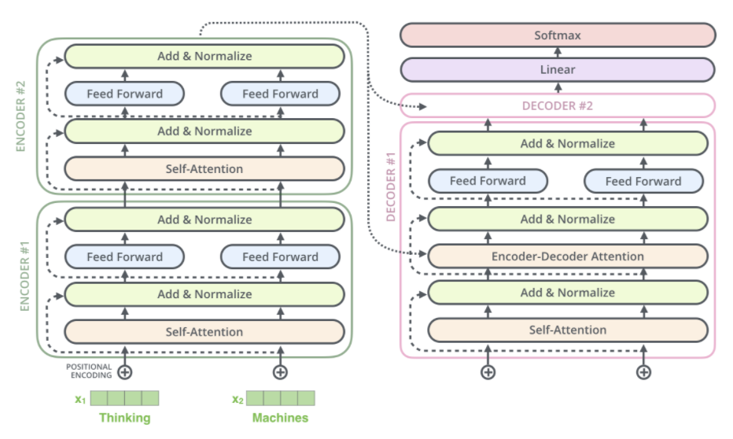

# 📜 Dialogue Summarizer

This dialogue summarizer is created by fine-tuning a base T5 model on a DialogueSum Dataset. The fine-tuning was done on two bases:
<li>PEFT Fine Tuning</li>
  <li>Full Fine Tuning</li>
 

## 🗃️ Dataset 

The DialogueSum dataset, a benchmark dataset designed specifically for abstractive
dialogue summarization, is used. It contains conversations from various domains, such as casual
dialogues, interviews, and debates, paired with human-generated concise summaries. This
dataset is particularly suited for training models that excel at understanding and summarizing
conversational exchanges.
The dataset was split as follows:
<li> Total Entries: 14,460 dialogues</li>
<li> Training Set: 12,460 dialogues (86.2%) for model training.</li>
<li> Validation Set: 500 dialogues (3.5%) for hyperparameter tuning.</li>
<li> Test Set: 1,500 dialogues (10.3%) held out for final evaluation and benchmarking.</li>

  

## ֎ T5 Model Overview
The Text-to-Text Transfer Transformer (T5) is a unified framework that treats every NLP
problem as a text-to-text task. This enables the model to excel in tasks requiring language
understanding and generation.

 

  

### Parameter-Efficient Fine-Tuning (PEFT)
#
PEFT methods adapt large pre-trained models like T5 to specific tasks without updating all
parameters. This approach is computationally efficient and reduces memory usage. Examples
include:

<li> LoRA (Low-Rank Adaptation): Adds low-rank matrices to specific layers for
task-specific learning.</li>
<li>Adapters: Introduces small trainable layers that work alongside the frozen model
parameters.</li>
<li>Prefix Tuning: Appends task-specific prefixes to input embeddings to guide the
model.</li>

 

  

### Full Fine Tuning
#

Large language model (LLM) fine-tuning is taking pre-trained models and further 
training them on smaller, specific datasets to refine their capabilities and improve
performance in a particular task or domain. Fine-tuning is about turning
general-purpose models into specialized models. It bridges the gap
between generic pre-trained models and the unique requirements of specific
applications, ensuring that the language model aligns closely with human
expectations.

